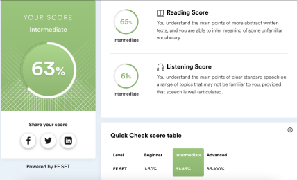

# CV: Irina Malinovskaya - Html/Css Coder


## Contacts:
**Phone** +79919330006

**Email** Happymalina@yndex.ru *(preferred means of communication)*

**Telegram** @irina_malinovskaya

**Actual location**  Saint Petersburg , Ready to relocate


[LinkedIn](https://www.linkedin.com/in/irina-malinovskaya-2056a0b4/ "LinkedIn Irina Malinovskaya")

----

## About me:
I've loved layout since the first Yandex page loaded on my first computer. I had a break and didn't do layout for a while, but then I decided to devote myself to what I really wanted to do.
Now markup, design, frontend, active lifestyle are all that mostly fills my day and my life. I love it all, and I try to learn something new every day.
Currently, I decided to delve into js, better study the React and Vue frameworks. I am also interested in design, especially interface design, UX/UI, analytics, prototyping and markup of email messages.
In my free time I do sports, I really love running, as well as drawing and traveling.
I expect that the RS School course will help to remember the very base, close the existing gaps, refresh the memory of what is forgotten. And also get practical experience in js and reach such a level that it is easy to explain to others "how it works".

----

## Skills
* Hard Skills
  + Stack: Html , Jade(Pug), CSS, SCSS/Less, BEM, Yarn/Npm, Gulp, Bootstrap/Foundation, JQuery/Javascript, Git(Gitlab) ;
  + Figma, Sketch, Avocode, Photoshop, InDesigб, Webflow, Tilda;
  + Wordpress, Bitrix;
  + Jira, Redmine , Slack , Trello;
  + Adaptive, Semantic Markup, A11Y;
  + Prototyping, Marvel;
  + Experiense: 
    - layout of promo pages, online stores, landing pages, emails, style guides,
    - layout and support of websites on the Wordpress and Bitrix engine,
    - working with Legacy code,
    - the hosting, the connection counter, Google Analytics and Yandex Metrics,
    - layout of templates for websites.
* Soft Skills:
    + timely communication with colleagues (designers, developers, managers)
    + the ability to formulate and set a task for yourself and others
    + the ability to give an estimate of the deadlines for the task
    + a sense of empathy and friendliness
    + calm and optimism
    + observation

----

## Example of code

Determining the day of the week when entering a number in the field

Markup
```
<input type="text" class="input" placeholder="Дата в формате 31.12.2016">
<p class="day-name">
  День недели: <b> </b>
</p>
```

Javascript
```
var input = document.querySelector('.input');
var dayNameText = document.querySelector('.day-name b');
var weekend = ["Воскресенье", "Понедельник", "Вторник", "Среда", "Четверг", "Пятница", "Суббота"];

input.addEventListener('blur', function(){

  var inputValue = this.value;
  var inputArray = inputValue.split('.');
  var inputArrayReverse = inputArray.reverse();
  var inputArrayJoin = inputArray.join(',');
  
  var actualDate = new Date(inputArrayJoin);
  var actualDay = actualDate.getDay();
 
  dayNameText.textContent = weekend[actualDay];
  
});
```

[Link on working task](https://jsfiddle.net/ubrwLatv/24/)

----

## Work experience 
*more than 7 Years*

#### "Большая тройка" (Moscow)
August 2019 — till now
**Position: HTML Developer/Designer**

#### Digital Sector (Krasnodar)
May 2018 — August 2019
**Position: Frontend Developer**

#### Digital Agency Krown (Sevastopol)
March 2016 — August 2016
**Position: Frontend Developer**

#### Freelance 
May 2015 — till now
**Position: HTML Developer/Designer/Frontend Developer**

#### Online Market Intelligence 
June 2014 — January 2015
**Position: Frontend Developer**

----

## Education

### Higher
**Российская академия Народного Хозяйства и Государственной службы при президенте РФ**

*Year of graduation - 2013*

State and Municipal administration, Manager-economist

### Secondary special education
**Санкт-Петербургский Промышленно-Экономический колледж**

*Year of graduation - 2005*

Banking, Banking Specialist

----

## Professional development, courses

### HTML Academy - 2021
Professional development of web interfaces. Javascript. Level 1

### HTML Academy - 2021
Markup of Emails

### Наука Дизайна - 2020
Design of interfaces

### Центр Дизайн Мышления - 2020
CX/UX. Interactive design

### udacity.com - 2019
Course A11y by Google

### HTML Academy - 2015
HTML и CSS. Level 2

### HTML Academy - 2014
HTML и CSS. Level


----

## Language skills

* Languages
    + Russian — Native
    + English — A2 - B1 (I am ready to raise the level, at the moment there is little practice)
    
    + German — A1 — Basic (School programm)

